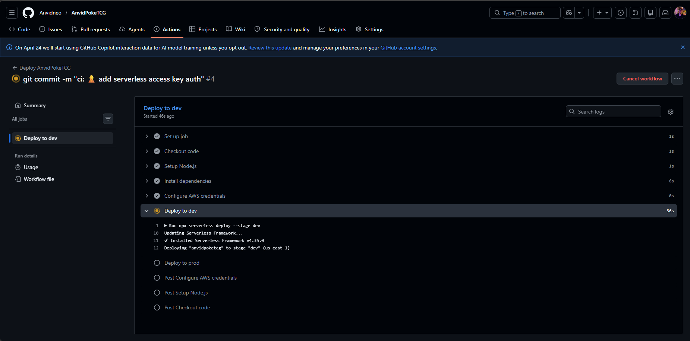
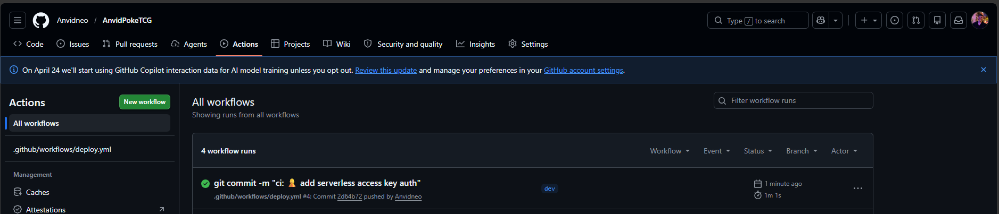

# AnvidPokeTCG API 🃏

> Serverless REST API for managing a Pokémon TCG inventory — sealed products & singles — built on AWS with the Serverless Framework.


---

## Overview

AnvidPokeTCG is a fully serverless REST API that lets you manage a personal Pokémon TCG collection database. You can track **sealed products** (booster boxes, Elite Trainer Boxes, tins, etc.) and **singles** (individual cards), including details like set, condition, language, quantity, and price.

### Architecture

```
Client → API Gateway (REST) → AWS Lambda (Node.js/TS) → DynamoDB
```

All infrastructure is defined as code using the **Serverless Framework** and deployed automatically via **GitHub Actions CI/CD** to two stages: `dev` and `prod`.

---

## Features

- Full **CRUD** operations for TCG products (sealed & singles)
- **Multi-stage** deployments (`dev` / `prod`)
- **Infrastructure as Code** — 100% automated with Serverless Framework
- **CI/CD pipeline** via GitHub Actions triggered on push to `dev` and `master`
- Written in **TypeScript** with strict typing
- Input validation with **Zod**
- Data persisted in **DynamoDB** with GSI for efficient filtering by type

---

## API Endpoints

Base URL: `https://rkbonelcr2.execute-api.us-east-1.amazonaws.com/dev`

| Method | Endpoint | Description |
|--------|----------|-------------|
| `POST` | `/products` | Create a new product |
| `GET` | `/products` | List all products |
| `GET` | `/products?type=sealed` | List products filtered by type |
| `GET` | `/products/{id}` | Get a single product by ID |
| `PUT` | `/products/{id}` | Update a product |
| `DELETE` | `/products/{id}` | Delete a product |

### Product Schema

```json
{
  "id": "uuid",
  "name": "Surging Sparks Booster Box",
  "type": "sealed",
  "set": "Surging Sparks",
  "condition": "NM",
  "language": "EN",
  "quantity": 2,
  "price": 149.99,
  "currency": "USD",
  "notes": "Sealed, purchased at release",
  "createdAt": "2025-01-01T00:00:00Z",
  "updatedAt": "2025-01-01T00:00:00Z"
}
```

**`type` values:** `sealed` | `single`  
**`condition` values:** `NM` | `LP` | `MP` | `HP` | `DMG`  
**`language` values:** `EN` | `JP` | `ES` | `DE` | `FR` | `IT` | `PT` | `KO` | `ZH`

---

## Project Structure

```
AnvidPokeTCG/
├── .github/
│   └── workflows/
│       └── deploy.yml              # CI/CD pipeline
├── src/
│   ├── functions/                  # Lambda entry points (handlers)
│   │   ├── createProduct.ts
│   │   ├── getProduct.ts
│   │   ├── listProducts.ts
│   │   ├── updateProduct.ts
│   │   └── deleteProduct.ts
│   ├── controllers/                # Business logic & orchestration
│   │   └── product.controller.ts
│   ├── services/                   # Use cases & domain logic
│   │   └── product.service.ts
│   ├── repositories/               # DynamoDB data access layer
│   │   └── product.repository.ts
│   ├── models/                     # TypeScript interfaces & types
│   │   └── product.model.ts
│   ├── dtos/                       # Request validation & shapes (Zod)
│   │   ├── create-product.dto.ts
│   │   └── update-product.dto.ts
│   └── utils/                      # HTTP responses, error handling
│       ├── response.ts
│       └── errors.ts
├── resources/
│   ├── dynamodb.yml                # DynamoDB table definition
│   └── functions.yml               # Lambda functions & endpoints
├── serverless.yml                  # Main Serverless config
├── tsconfig.json
├── package.json
└── README.md
```

### Request Flow

```
Lambda Handler → Controller → Service → Repository → DynamoDB
                     ↑
                   DTOs (Zod validation)
                   Models (type definitions)
```

---

## Prerequisites

- [Node.js 22+](https://nodejs.org/)
- [Serverless Framework CLI](https://www.serverless.com/framework/docs/getting-started) (`npm install -g serverless`)
- AWS account with programmatic access (Access Key ID + Secret)
- Serverless Framework account ([app.serverless.com](https://app.serverless.com))

---

## Local Setup

```bash
# Clone the repository
git clone https://github.com/Anvidneo/AnvidPokeTCG.git
cd AnvidPokeTCG

# Install dependencies
npm install

# Copy environment variables
cp .env.example .env
# Fill in your AWS credentials in .env

# Run locally (requires DynamoDB Local or deploy to AWS first)
serverless offline

# Deploy to dev
serverless deploy --stage dev
```

---

## CI/CD Pipeline

Deployments are handled automatically by **GitHub Actions**.

| Trigger | Stage |
|---------|-------|
| Push to `dev` | `dev` |
| Push to `master` | `prod` |
| Release published | `prod` |

### Required GitHub Secrets

Go to **Settings → Secrets and variables → Actions** and add:

| Secret | Description |
|--------|-------------|
| `AWS_ACCESS_KEY_ID` | AWS access key |
| `AWS_SECRET_ACCESS_KEY` | AWS secret key |
| `SERVERLESS_ACCESS_KEY` | Serverless Framework access key |

### CI/CD Screenshots




---

## Environment Variables

| Variable | Description | Default |
|----------|-------------|---------|
| `STAGE` | Deployment stage | `dev` |
| `PRODUCTS_TABLE` | DynamoDB table name | `anvidpoketcg-products-{stage}` |
| `REGION` | AWS region | `us-east-1` |

---

## Running Tests

```bash
# Unit tests
npm test

# Watch mode
npm run test:watch
```

---

## Deployment

```bash
# Deploy to dev
serverless deploy --stage dev

# Deploy to prod
serverless deploy --stage prod

# Remove stack
serverless remove --stage dev
```

---

## Demo

> 🎥 A full walkthrough of the codebase, infrastructure, and CI/CD pipeline is available on Loom:  
> **[Watch the demo](#)** ← *(link to be added)*

---

## License

MIT — feel free to fork and adapt for your own TCG inventory needs.